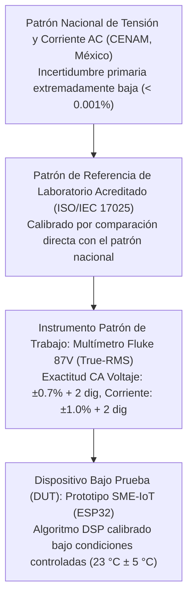

# Diseño e Implementación de un Sistema IoT de Bajo Costo para la Monitorización No Intrusiva de Consumo Eléctrico Residencial mediante Arquitectura ESP32

## Contenido

1. Antecedentes del problema
2. Planteamiento del problema
3. Objetivo general
4. Objetivos específicos
5. Justificación
6. Marco Teórico
7. Hipótesis
8. Diseño metodológico
9. Cronograma
10. Presupuesto y financiamiento
11. Fuentes de información
12. Anexos

## 1 Antecedentes del problema

La gestión de la demanda energética es fundamental en la transición hacia redes eléctricas inteligentes (*Smart Grids*).

A nivel global, los Objetivos de Desarrollo Sostenible (ODS 7 y 12) subrayan la necesidad de mejorar la eficiencia energética residencial.

En México, el esquema tarifario de la Comisión Federal de Electricidad (CFE) estructura el costo en categorías escalonadas (tarifas 1 a 1F), penalizando el alto consumo mediante la tarifa DAC (Doméstica de Alto Consumo), la cual elimina el subsidio gubernamental.

Sin embargo, los medidores convencionales electromecánicos o digitales estándar funcionan como dispositivos de registro acumulativo sin capacidad de retroalimentación instantánea, limitando la capacidad del usuario para corregir hábitos de consumo en tiempo real.

Históricamente, el monitoreo no intrusivo de carga (NILM) ha evolucionado desde métodos analógicos hasta arquitecturas basadas en Internet de las Cosas (IoT).

Plataformas de hardware abierto como OpenEnergyMonitor han demostrado la viabilidad de usar sensores de corriente de núcleo partido y la biblioteca `EmonLib`, pero sus costos de adquisición e importación (>\$2,000 MXN) siguen siendo elevados para el mercado nacional.

Estudios recientes como Kaselimi et al. (2022) identifican como brechas pendientes la confiabilidad en escenarios reales y la accesibilidad para su implementación masiva en el sector doméstico.

## 2 Planteamiento del problema

El problema central radica en la desconexión entre el consumo físico de energía y la conciencia del usuario.

La falta de herramientas de diagnóstico accesibles impide la detección de consumos fantasma o ineficiencias en electrodomésticos.

Las causas son multifactoriales: opacidad de la medición fiscal, barreras económicas (costo de equipos comerciales como Sense o Shelly EM >\$1,500 MXN), complejidad de instalación y la invisibilidad inherente del recurso eléctrico.

Además, las fluctuaciones de voltaje en la red mexicana distorsionan las estimaciones basadas exclusivamente en medición de corriente.

Pregunta de investigación: ¿Es factible desarrollar e implementar un sistema de monitoreo eléctrico residencial IoT que, mediante la medición simultánea de voltaje y corriente con sensores no intrusivos y un microcontrolador ESP32, reduzca el costo de adquisición en un 60% respecto a analizadores de red comerciales, garantizando una precisión superior al 95% en el cálculo de potencia activa real y permitiendo la detección de anomalías en el suministro, validándolo en una vivienda unifamiliar con servicio monofásico ubicada en Tenango del Valle, Estado de México?

## 3 Objetivo general

Diseñar, implementar y validar un sistema de monitoreo de consumo eléctrico residencial de bajo costo y no intrusivo, basado en el microcontrolador ESP32 y sensores de corriente tipo *clamp* (SCT-013) y de voltaje (ZMPT101B), capaz de calcular la potencia activa en tiempo real con un error inferior al 5% respecto a instrumentación de referencia, y de transmitir los datos de manera inalámbrica mediante conectividad WiFi.

## 4 Objetivos específicos

* Analizar los requerimientos funcionales y no funcionales del sistema bajo las condiciones de la infraestructura eléctrica mexicana y las restricciones técnicas de los componentes.
* Diseñar la etapa de hardware del sistema, incluyendo el circuito de acondicionamiento de señal para los sensores SCT-013, ZMPT101B, y el sistema de alimentación conmutada AC-DC integrado.
* Desarrollar el firmware de adquisición de datos y procesamiento digital de señales —cálculo de corriente eficaz ($I_{RMS}$), voltaje eficaz ($V_{RMS}$) y potencia activa ($P$)— sobre la arquitectura de doble núcleo del ESP32.
* Implementar la interfaz de usuario local (pantalla OLED SSD1306) y el módulo de almacenamiento local (tarjeta microSD) para la visualización y registro histórico.
* Validar el desempeño del prototipo mediante pruebas comparativas contra instrumentación patrón (multímetro TRMS calibrado) en laboratorio y campo.
* Evaluar la viabilidad económica del dispositivo mediante el análisis de la lista de materiales (BOM) y la comparación de costos frente al mercado.

## 5 Justificación

La investigación es conveniente porque proporciona una herramienta de diagnóstico instantáneo frente a la opacidad de la medición fiscal bimestral de CFE.

Tiene relevancia social al democratizar el acceso a tecnología de eficiencia energética para familias mexicanas, reduciendo el costo de inversión a ~\$600 MXN.

Desde una implicación práctica, permite identificar patrones de uso ineficiente sin riesgos de instalación intrusiva, eliminando la necesidad de alterar el cableado fijo de la vivienda.

Aporta valor teórico al validar la aplicabilidad de la Ley de Faraday y el teorema de Nyquist-Shannon en una plataforma de hardware con restricciones severas de costo y resolución (ADC de 12 bits).

## 6 Marco Teórico

El desarrollo de sistemas de monitoreo eléctrico residencial basados en microcontroladores y plataformas IoT ha sido objeto de investigación creciente. A continuación, se definen las bases teóricas y el funcionamiento detallado de los componentes de este proyecto, integrando ecuaciones físicas de electromagnetismo, leyes de corriente alterna y fundamentos de procesamiento digital de señales:

* **Microcontrolador ESP32 y Sistemas Embebidos (IoT):** La unidad central de procesamiento y conectividad del proyecto es el System-on-Chip (SoC) ESP32, desarrollado por Espressif Systems.
  
  Su arquitectura específica es vital para este proyecto por las siguientes razones de diseño:
  * **Procesamiento de Doble Núcleo (Xtensa® LX6 de 32 bits a 240 MHz):** El sistema operativo en tiempo real FreeRTOS se utiliza para asignar tareas concurrentes de forma separada.
  
    El **Núcleo 1 (APP)** se dedica exclusivamente a tareas críticas de adquisición ininterrumpida de datos analógicos a alta velocidad (aprox. 2 kHz) y al procesamiento de señales digitales (cálculo iterativo de $I_{RMS}$, $V_{RMS}$ y potencia $P$).
    
    El **Núcleo 0 (PRO)** asume la carga de gestionar la interfaz de usuario local (pantalla OLED vía protocolo I2C), el almacenamiento de historial de consumos (tarjeta microSD por SPI) y, críticamente, la conectividad inalámbrica WiFi y la pila de protocolos TCP/IP (MQTT/HTTP).
    
    Esta separación de hardware garantiza que el muestreo de la red eléctrica nunca se interrumpa por retardos inherentes a la comunicación inalámbrica o almacenamiento masivo.
  * **Restricciones del Convertidor Analógico-Digital (ADC):** El ESP32 integra dos bloques ADC de 12 bits (ADC1 y ADC2).
  
    Existe una limitación arquitectónica documentada por el fabricante (Espressif Systems, 2022) en la cual el bloque ADC2 no puede operar simultáneamente con el módem WiFi. Por esta razón, el diseño restringe rigurosamente los pines de sensado de corriente y voltaje al bloque ADC1 (pines GPIO 32 a 39).
    
    La resolución de 12 bits proporciona 4096 niveles de cuantización ($2^{12}$) sobre un rango unipolar de 0 a 3.3 V, otorgando suficiente granularidad para electrodomésticos comunes, pero introduciendo un piso de ruido de cuantización para cargas inferiores a 25 W (modo *standby*), considerándose la zona muerta del proyecto.
* **Sensor de Corriente SCT-013-030 (Monitoreo No Intrusivo):** El funcionamiento de este sensor tipo *clamp* de núcleo partido se fundamenta en la **Ley de Faraday de la Inducción Electromagnética** y la **Ley de Ampère**:
  
  $$\oint \mathbf{B} \cdot d\mathbf{l} = \mu_0 I_{encl}$$
  
  La corriente alterna ($i_p(t)$) que circula por el cable conductor primario de la acometida genera un campo magnético variable en el núcleo de ferrita partido. Al cerrarse la pinza magnética alrededor del cable, este flujo magnético variable ($\Phi_B(t)$) se concentra en el núcleo de ferrita de alta permeabilidad magnética ($\mu_r \approx 2000$). De acuerdo con la **Ley de Faraday-Lenz**, este flujo variable induce una fuerza electromotriz ($\varepsilon$) en el devanado secundario del sensor compuesto por $N = 3000$ espiras:
  
  $$\varepsilon = -N \frac{d\Phi_B}{dt}$$
  
  Como consecuencia de esta inducción magnética, se establece una corriente secundaria proporcional:
  
  $$i_s(t) = \frac{i_p(t)}{N}$$
  
  El submodelo "030" integra una resistencia de carga interna (*burden resistor*) de $62\,\Omega$ de alta precisión, la cual convierte la corriente secundaria inducida en una tensión alterna proporcional, entregando directamente una salida máxima nominal de $1\text{ V}$ RMS a $30\text{ A}$ de corriente primaria.
  
  Dado que el ADC del ESP32 no soporta voltajes negativos, se implementa un circuito de acondicionamiento físico con un divisor de tensión resistivo (dos resistores de precisión de $10\text{ k}\Omega$) para inyectar un *offset* DC de $1.65\text{ V}$. Esto permite que la señal oscile de manera segura y unipolar en el ADC de 0 V a 3.3 V.
* **Sensor de Voltaje ZMPT101B y Aislamiento Galvánico:** Este componente incorpora un transformador miniatura de voltaje de alta precisión que provee un aislamiento galvánico de alta seguridad (típicamente calificado hasta 4,000 V de tensión de aislamiento) para la lectura directa de la red eléctrica de 127 V AC.
  
  A diferencia de métodos simplificados que asumen un voltaje teórico nominal constante de 127 V (lo que induce a errores metrológicos debido a fluctuaciones y armónicos), medir esta variable instantánea real permite contabilizar fidedignamente los armónicos, detectar caídas de tensión (*sags*), y proteger los cálculos de consumo frente a las variaciones comunes en la red eléctrica de CFE.
  
  Para asegurar total seguridad del microcontrolador sin requerir divisores de tensión analógicos externos que distorsionen la señal, el módulo se alimenta directamente a 3.3 V DC, de forma que su amplificador operacional integrado (LM358) entrega un offset analógico automático de exactamente 1.65 V (VCC/2), permitiendo que la onda de tensión alterna reducida oscile de forma segura y unipolar dentro del rango tolerable del pin analógico GPIO 33 (ADC1) del ESP32.
* **Teoría de Potencia en Corriente Alterna y Cargas No Lineales:** La potencia eléctrica instantánea en una red de corriente alterna se define como el producto del voltaje instantáneo y la corriente instantánea:
  
  $$p(t) = v(t) \cdot i(t)$$
  
  En un sistema donde la carga es puramente resistiva y lineal, las ondas de corriente y voltaje están perfectamente en fase, por lo que toda la energía suministrada se transforma en trabajo útil. Sin embargo, en el entorno residencial real, los electrodomésticos incorporan componentes reactivos (motores, compresores de refrigeración) y no lineales (fuentes conmutadas de computadoras y lámparas LED). 
  
  La presencia de reactancia inductiva produce un desfase angular ($\theta$) entre las señales sinusoidales de voltaje y corriente. La **potencia activa ($P$ en Watts)** representa el promedio temporal de la potencia instantánea sobre un período completo $T$:
  
  $$P = \frac{1}{T} \int_0^T v(t) \cdot i(t) \, dt$$
  
  La **potencia aparente ($S$ en Volt-Amperios)** representa la capacidad máxima teórica del sistema, definida como el producto de los valores eficaces de voltaje y corriente:
  
  $$S = V_{RMS} \cdot I_{RMS}$$
  
  La **potencia reactiva ($Q$ en Volt-Amperios Reactivos)** es la potencia que oscila de ida y vuelta entre la fuente y los campos magnéticos/eléctricos de la carga:
  
  $$Q = V_{RMS} \cdot I_{RMS} \sin\theta$$
  
  El **Factor de Potencia ($FP$)** es la relación entre la potencia activa y la potencia aparente:
  
  $$FP = \frac{P}{S} = \cos\theta$$
  
  En presencia de cargas no lineales modernas, las corrientes no son senoidales perfectas, introduciendo distorsión armónica total (THD). El factor de potencia total se descompone entonces en un factor de desplazamiento ($\cos\theta$) y un factor de distorsión debido a los armónicos de corriente:
  
  $$FP_{total} = \frac{I_{1,RMS}}{I_{RMS}} \cos\theta$$
  
  Donde $I_{1,RMS}$ es la corriente eficaz en la frecuencia fundamental de 60 Hz e $I_{RMS}$ es la corriente eficaz total. Este proyecto resuelve la medición de potencia activa real en presencia de distorsión mediante el procesamiento síncrono digital instantáneo de las muestras de tensión y corriente en bucle cerrado, igualando la precisión metrológica exigida por CFE.
* **Muestreo Discreto y Procesamiento Digital de Señales (DSP):** De acuerdo con el **Teorema de Muestreo de Nyquist-Shannon**, para reconstruir fidedignamente una señal analógica continua de frecuencia máxima $f_{max}$ sin efecto de aliasing (*solapamiento*), la frecuencia de muestreo discreto ($f_s$) debe satisfacer la condición:
  
  $$f_s \geq 2 f_{max}$$
  
  En la red eléctrica monofásica de 60 Hz en México, la presencia de cargas conmutadas genera armónicos de hasta el 15º orden ($f_{15} = 900\text{ Hz}$). Por tanto, se requiere una frecuencia de muestreo superior a 1.8 kHz. 
  
  El firmware implementado en el ESP32 ejecuta una rutina iterativa de adquisición analógica en el Núcleo 1 que muestrea las señales a $f_s \approx 2\text{ kHz}$. El algoritmo en tiempo real neutraliza el *offset* de 1.65 V de cada muestra digitalizada y calcula las siguientes métricas estadísticas sobre un intervalo cerrado de $N$ muestras (aproximadamente 2000 muestras equivalentes a varios ciclos completos de red):
  
  * **Voltaje Eficaz Discreto ($V_{RMS}$):**
    $$V_{RMS} = \sqrt{\frac{1}{N} \sum_{n=0}^{N-1} (v[n] - V_{offset})^2}$$
  
  * **Corriente Eficaz Discreta ($I_{RMS}$):**
    $$I_{RMS} = \sqrt{\frac{1}{N} \sum_{n=0}^{N-1} (i[n] - I_{offset})^2}$$
  
  * **Potencia Activa Discreta ($P$):**
    $$P = \frac{1}{N} \sum_{n=0}^{N-1} (v[n] - V_{offset}) \cdot (i[n] - I_{offset})$$
  
  Esta aproximación de procesamiento discreto en el firmware permite calcular el verdadero valor eficaz y la potencia activa real bajo condiciones arbitrarias de distorsión y factor de potencia, superando significativamente las aproximaciones tradicionales de voltaje nominal constante.
* **Fuentes de Alimentación Conmutadas (SMPS) y Normatividad:** Se empleará un convertidor AC/DC tipo *buck* de alta frecuencia (Hi-Link) para bajar la tensión de 127 V AC a 5 V DC, proporcionando eficiencia energética (>70%) en un formato integrado.
  
  Todo el ensamble respetará las pautas de instalación de la **NOM-001-SEDE-2012**, operando exclusivamente como un prototipo educativo de autodiagnóstico no intrusivo, desprovisto de valor fiscal o legal ante dependencias federales.
* **Protocolos de Comunicación y Conectividad IoT (I2C, SPI y MQTT):** La interacción armoniosa del ESP32 con sus periféricos locales y la nube requiere de buses y protocolos de red altamente optimizados.
  
  * **Bus I2C (Inter-Integrated Circuit):** Desarrollado por NXP Semiconductors (2021) bajo la especificación de referencia, es un estándar síncrono que utiliza dos líneas bidireccionales con resistencias *pull-up*: SDA (datos) y SCL (reloj). El firmware del ESP32 implementa este protocolo en la interfaz con la pantalla OLED SSD1306, operando con direccionamiento de 7 bits a una velocidad máxima de 400 kHz (Fast-mode). La principal ventaja es el ahorro drástico de pines físicos, requiriendo solo dos pines GPIO para gestionar el display de visualización instantánea.
  * **Bus SPI (Serial Peripheral Interface):** Diseñado originalmente por Motorola, Inc. (2003), es un protocolo de comunicación serial síncrono de cuatro hilos: MOSI (Master Out Slave In), MISO (Master In Slave Out), SCK (Serial Clock) y CS (Chip Select). A diferencia de I2C, SPI opera en modo dúplex completo a velocidades que superan los 10 MHz en este desarrollo, permitiendo al ESP32 escribir los registros de consumo eléctrico masivo en la tarjeta microSD de forma extremadamente ágil, reduciendo a microsegundos el retardo de escritura e impidiendo bloqueos del lazo de muestreo del ADC en el núcleo activo.
  * **Protocolo MQTT (Message Queuing Telemetry Transport):** Estandarizado oficialmente por OASIS (2019), es un protocolo de comunicación de capa de aplicación basado en el modelo asíncrono publicador/suscriptor. MQTT está diseñado sobre la pila de protocolos TCP/IP (puerto 1883 por defecto) y es sumamente óptimo para sistemas embebidos de monitoreo debido a su encabezado ultraligero de tan solo 2 bytes en su paquete básico, reduciendo de manera radical el ancho de banda y la sobrecarga de procesamiento respecto al protocolo HTTP tradicional. En el prototipo, el ESP32 se comporta como un *Cliente Publicador*, estructurando las lecturas procesadas de potencia en tópicos jerárquicos estructurados (ej. `casa/monitoreo/potencia_activa`), y transmitiéndolas de manera asíncrona hacia un Broker local o en la nube (ej. Mosquitto), lo que permite que una aplicación web o móvil consuma los datos históricos en tiempo real con una latencia inferior a los 100 ms y con niveles definidos de Calidad de Servicio (QoS 0 para telemetría básica de alta velocidad y QoS 1 para asegurar la entrega de datos críticos de consumo acumulado).

## 7 Hipótesis

En el marco de la ingeniería de diseño con prototipos, las hipótesis de este estudio conectan de forma explícita las variables de **desempeño metrológico** ($I_{RMS}$, $V_{RMS}$, $P$, MAPE, $R^2$), las variables de **viabilidad económica** (costo de la BOM) y las condiciones de operación de la red eléctrica.

* **Hipótesis general (de investigación - $H_i$):** Es factible desarrollar un sistema de monitoreo eléctrico residencial basado en IoT que, mediante el uso de hardware de código abierto y componentes genéricos optimizados (ESP32, SCT-013, ZMPT101B), reduzca los costos de manufactura por debajo de los \$600.00 MXN por unidad, manteniendo un error de medición de potencia activa inferior al 5% en cargas domésticas estándar superiores a 25 W.
  
  Esta hipótesis establece un umbral numérico que permite la validación rigurosa mediante un multímetro patrón.
* **Hipótesis nula ($H_0$):** El sistema propuesto no alcanza la precisión requerida (presentando un error porcentual sostenido $> 5\%$) o su costo de manufactura excede irremediablemente los \$600.00 MXN por unidad, invalidando la viabilidad técnico-económica de la propuesta.
* **Hipótesis alternativa ($H_1$):** El sistema propuesto logra un costo de manufactura ≤ \$600.00 MXN por unidad y alcanza un error porcentual de potencia activa ≤ 5% en cargas domésticas superiores a 25 W.
* **Hipótesis específicas (Operacionales):**
  * **Linealidad del sensado de corriente:** El sensor SCT-013-030 acondicionado analógicamente con un *offset* DC de 1.65 V mantendrá una relación estrictamente lineal con la corriente eficaz real de la carga, esperando un coeficiente de determinación $R^2 > 0.98$ en el rango de 0.5 A a 30 A.
  * **Estabilidad de la fuente de alimentación:** La fuente integrada conmutada tipo Hi-Link presentará un rizado de tensión menor a 50 mVpp, garantizando que no introducirá ruido paramétrico de alta frecuencia que desestabilice el piso de cuantización del ADC del ESP32.
  * **Cálculo de potencia activa real:** La medición síncrona de las magnitudes instantáneas $v[n]$ e $i[n]$ en bucle cerrado permitirá procesar la potencia $P$ con una exactitud estadísticamente superior a los modelos básicos (que asumen un voltaje nominal constante de 127 V).
  * **Viabilidad económica:** La Lista de Materiales completa (BOM) no superará los \$600.00 MXN, materializando una reducción de costo de al menos el 60% frente a analizadores de espectro comerciales.

## 8 Diseño metodológico

El bosquejo del método está diseñado para asegurar tanto la **validez interna** (en pruebas controladas de calibración) como la **validez externa** (operación real en campo), asegurando trazabilidad y repetibilidad.

### 8.1 Universo (Población de estudio)
En el contexto de un estudio experimental con prototipos de hardware, el universo no está constituido por sujetos humanos, sino por el conjunto de **todas las posibles condiciones de carga eléctrica de medición** que pueden presentarse en una vivienda residencial monofásica, dentro del rango físico de operación del sensor (0 a 30 A).

El entorno futuro de validación de campo será una vivienda unifamiliar con servicio monofásico (127 V, 60 Hz) ubicada en Tenango del Valle, Estado de México.

### 8.2 Tamaño de la muestra
Se establecerán **270 pares de observaciones** (prototipo frente a instrumento patrón) distribuidas en 9 niveles de carga discretos (0.5 A, 1 A, 2 A, 5 A, 10 A, 15 A, 20 A, 25 A y 30 A) con un mínimo de 30 repeticiones por cada nivel.

El muestreo será **no probabilístico intencional**, asegurando meticulosamente la cobertura del rango dinámico completo del dispositivo.
* **Criterios de inclusión:** Cargas resistivas puras (lámparas incandescentes, planchas) y cargas inductivas comunes (motores fraccionarios, ventiladores), conectadas a la red monofásica de 127 V/60 Hz.
* **Criterios de exclusión:** Cargas que demanden una corriente inferior a 0.2 A (situadas en la zona muerta de umbral de ruido del ADC), infraestructura trifásica, y equipos que generen distorsión armónica extrema (variadores de frecuencia industriales).

### 8.3 Tipos de investigación a realizar
* **Finalidad:** *Aplicada y Tecnológica* (transforma la teoría de procesamiento de señales en un prototipo tangible).
* **Enfoque:** *Cuantitativo* (el éxito depende de magnitudes numéricas verificables como $I_{RMS}$, $V_{RMS}$, $P$, y reducción de costos).
* **Alcance:** *Correlacional y Explicativo* (se analizará la correlación directa entre el instrumento patrón y el prototipo, explicando variables de desviación estadística).
* **Lugar:** Diseño *Mixto*, comenzando con una rigurosa fase experimental en el entorno aislado de un **laboratorio**, seguida de validaciones observacionales en **campo** (vivienda real).

### 8.4 Tipo de instrumento a utilizar para la recolección de la información
El instrumento tecnológico de medición principal (DUT, *Device Under Test*) bajo validación experimental será el **Prototipo SME-IoT** configurado con el microcontrolador ESP32 y los transductores analógicos SCT-013-030 (corriente) y ZMPT101B (voltaje).

Para la validación de su desempeño metrológico y exactitud se utilizará un **Multímetro Industrial de Verdadero Valor Eficaz Fluke 87V (Instrumento Patrón)** como dispositivo de referencia. El Fluke 87V posee una pantalla de 20,000 cuentas de alta resolución y cuenta con una exactitud básica garantizada en corriente alterna (tensión de verdadero valor eficaz) de $\pm (0.7\% + 2)$ en lecturas de 50 Hz a 5 kHz, y de $\pm (1.0\% + 2)$ en mediciones de corriente AC de verdadero valor eficaz (Fluke Corporation, 2020). Este instrumento patrón cuenta con un certificado de calibración vigente trazable ante el Centro Nacional de Metrología (CENAM) o laboratorios acreditados por la Entidad Mexicana de Acreditación (EMA) bajo el estándar internacional **ISO/IEC 17025:2017**, garantizando la cadena de trazabilidad del experimento.

#### 8.4.1 Cadena de Trazabilidad Metrológica
La validez metrológica de las mediciones del prototipo reside en su cadena de trazabilidad ininterrumpida hacia los patrones nacionales del CENAM en México. A continuación, se detalla la pirámide de trazabilidad establecida para este protocolo de investigación:

1. **Patrón Nacional de Tensión y Corriente (CENAM):** Representa el eslabón metrológico de mayor jerarquía en la República Mexicana. Custodia y mantiene los patrones de referencia de la magnitud del voltio y el amperio AC con la menor incertidumbre del país.
2. **Patrón de Referencia del Laboratorio Secundario Acreditado:** Laboratorio metrológico externo acreditado por la EMA que calibra de forma periódica el instrumento de trabajo contra sus patrones de transferencia de alta exactitud.
3. **Instrumento Patrón de Trabajo (Fluke 87V):** Utilizado de forma directa en el banco de pruebas para certificar la calibración del prototipo. El instrumento patrón cuenta con un filtro paso bajo integrado seleccionable que atenúa frecuencias espurias superiores a 1 kHz, eliminando ruidos externos de alta frecuencia que puedan falsear la calibración de la componente fundamental de 60 Hz.
4. **Prototipo SME-IoT (Dispositivo Bajo Prueba):** Calibrado mediante un método estadístico de regresión y ajuste de factores de escala en un ambiente de laboratorio controlado (temperatura de 23 °C $\pm 5$ °C y humedad relativa inferior al 80%), garantizando que las mediciones residenciales posteriores mantengan una incertidumbre expandida conocida.

La recolección de datos aplicará la observación estructurada sistemática y automatizada. Las lecturas instantáneas y procesadas de voltaje ($V_{RMS}$), corriente ($I_{RMS}$), potencia activa ($P$), potencia aparente ($S$) y factor de potencia ($FP$) obtenidas por el Prototipo SME-IoT se registrarán en una **tarjeta microSD** (clase 10 mediante bus SPI) de forma de archivo plano delimitado por comas (.CSV) de manera persistente. Cada muestra contará con una estampa de tiempo analógica proporcionada por un módulo de reloj de tiempo real RTC de alta precisión (DS3231) para asegurar su ordenamiento cronológico unívoco.

### 8.5 Procesamiento y Análisis de Datos Estadísticos y Calibración
Los datos recopilados en laboratorio y campo serán procesados y analizados utilizando herramientas computacionales avanzadas como Python (bibliotecas Pandas, NumPy y SciPy) y Microsoft Excel. 

Para comprobar las hipótesis operacionales y la viabilidad metrológica del prototipo frente al instrumento patrón de referencia, se estructurará el análisis en tres fases estadísticas y algebraicas:

#### 8.5.1 Algoritmo de Calibración Teórica y Ajuste de Coeficientes
El firmware del ESP32 utiliza constantes multiplicativas para convertir las lecturas de los canales analógicos del ADC1 en valores de voltaje y corriente físicos. Previo a las pruebas experimentales, el prototipo se someterá a una fase de calibración empírica en banco de pruebas con cargas resistivas puras estables de referencia. Los coeficientes se calculan de la siguiente manera:

* **Coeficiente de Calibración de Voltaje ($V_{CAL}$):**
  $$V_{CAL} = \frac{V_{Patron\_RMS}}{V_{Prototipo\_Crudo}}$$
  Donde $V_{Patron\_RMS}$ es la tensión eficaz medida por el multímetro de referencia y $V_{Prototipo\_Crudo}$ es el valor eficaz discretizado en el ADC sin factor de escala.
* **Coeficiente de Calibración de Corriente ($I_{CAL}$):**
  $$I_{CAL} = \frac{I_{Patron\_RMS}}{I_{Prototipo\_Crudo}}$$
* **Ajuste de Calibración de Desfase de Fase ($Phase_{CAL}$):**
  Los sensores inductivos (SCT-013 y ZMPT101B) introducen un retardo de fase diferencial sistemático que causa un desplazamiento angular ficticio entre la corriente y el voltaje, alterando drásticamente el cálculo de la potencia activa y el factor de potencia. Para solucionar este problema en el procesamiento de señales digitales del ESP32, el firmware implementa una interpolación lineal para aproximar el valor desplazado del voltaje:
  $$v_{corregido}[n] = v[n] + Phase_{CAL} \cdot (v[n] - v[n-1])$$
  El coeficiente $Phase_{CAL}$ se calibra conectando una carga puramente resistiva ($\cos\theta = 1.00$) y ajustando iterativamente el parámetro hasta que la potencia activa ($P$) calculada iguale matemáticamente a la potencia aparente ($S$), anulando el error por desfase angular en el firmware.

#### 8.5.2 Análisis Metrológico y Validación de Hipótesis
Una vez calibrado el sistema, se aplicarán las siguientes técnicas estadísticas para determinar la veracidad y concordancia del prototipo:
* **Estadística Descriptiva Paramétrica:** Cálculo de medias aritméticas, desviaciones estándar e intervalos de confianza del 95% para cada nivel de corriente experimental.
* **Regresión Lineal Simple y Análisis de Varianza (ANOVA):** Ajuste de curvas de calibración para evaluar la linealidad y el coeficiente de determinación ($R^2$), requiriendo que $R^2 > 0.98$ para validar la linealidad operacional en el rango de 0.5 A a 30 A.
* **Métrica de Exactitud Metrológica (MAPE):** El criterio de éxito metrológico se evaluará mediante el **Error Porcentual Absoluto Medio (MAPE)**:
  $$MAPE = \frac{100\%}{M} \sum_{m=1}^{M} \left| \frac{X_{Patron,m} - X_{Prototipo,m}}{X_{Patron,m}} \right|$$
  Donde $M$ es la cantidad de repeticiones y $X$ representa la variable de potencia activa real. Se validará la hipótesis de investigación ($H_i$) si el MAPE obtenido es inferior al 5% en cargas superiores a 25 W.
* **Prueba de Concordancia Metrológica de Bland-Altman:** Se graficarán las diferencias entre ambos métodos contra su media promedio para cuantificar el sesgo sistemático medio y los límites de concordancia ($\pm 1.96$ desviaciones estándar). Adicionalmente, se comprobará la normalidad de las diferencias con la prueba de **Shapiro-Wilk** y se ejecutará una **prueba t de Student pareada** (con nivel de significancia $\alpha = 0.05$) para verificar si existe una diferencia estadísticamente significativa entre las mediciones del prototipo y el instrumento patrón, garantizando concordancia académica de nivel internacional.

#### 8.5.3 Procedimiento Metrológico de Ejecución y Adquisición Experimental
Para garantizar la validez metodológica y la repetibilidad del experimento, el proceso de calibración y recolección de observaciones se estructurará rigurosamente en una rutina secuencial detallada a continuación:

1. **Fase de Aclimatación y Estabilización Térmica:**
   * El prototipo SME-IoT y el multímetro Fluke 87V se conectarán en el banco de pruebas de laboratorio bajo condiciones ambientales controladas de 23 °C $\pm 5$ °C.
   * Se mantendrán energizados en vacío (sin carga de corriente primaria) durante un periodo de **15 minutos**. Este paso es crítico para estabilizar las derivas de temperatura internas de las resistencias divisoras de precisión y anular el desplazamiento térmico (*thermal drift*) de los amplificadores operacionales del ZMPT101B.
2. **Determinación del Offset Estático en Reposo ($I_{offset}$ y $V_{offset}$):**
   * Con la corriente del circuito primario en exactamente cero amperios (0.00 A), se iniciará una rutina rápida de muestreo continuo en el ESP32 (10,000 muestras consecutivas).
   * El firmware registrará el valor medio aritmético entregado por los canales analógicos GPIO 32 y 33, fijando los coeficientes matemáticos de $I_{offset}$ y $V_{offset}$ para el proceso discreto posterior, cancelando cualquier desviación en vacío del convertidor del microcontrolador.
3. **Calibración Empírica de Factores de Escala ($V_{CAL}$ e $I_{CAL}$):**
   * Se conectará una carga puramente resistiva estable de media potencia (ej. resistencia calefactora lineal de 1,200 W a 127 V, que demanda aprox. 9.45 A).
   * Se registrarán simultáneamente las lecturas estables TRMS de voltaje y corriente en el multímetro Fluke 87V y los valores de tensión crudos computados por el ESP32.
   * Se calcularán y almacenarán en la memoria no volátil (EEPROM/Flash) del ESP32 las constantes resultantes $V_{CAL}$ e $I_{CAL}$ empleando las ecuaciones descritas en la sección 8.5.1.
4. **Calibración Dinámica del Desfase Angular ($Phase_{CAL}$):**
   * Manteniendo conectada la carga resistiva pura (con factor de potencia real de 1.00 $\pm 0.00$ verificado en el Fluke 87V), se observará el cálculo de factor de potencia arrojado por el firmware.
   * Se ajustará de forma incremental y decreciente el factor $Phase_{CAL}$ en el firmware mediante la consola serial hasta lograr que el Factor de Potencia calculado sea de **1.00 $\pm 0.01$** de forma sostenida durante 1 minuto, corrigiendo con exactitud el retraso magnético diferencial de los transductores.
5. **Rutina de Recolección de Datos de la Muestra Experimental:**
   * Se utilizará un autotransformador variable (Variac) y un banco de cargas mixtas (resistores de potencia y reactancias inductivas variables) para inyectar de forma secuencial y estable los 9 niveles de corriente bajo estudio: 0.5 A, 1 A, 2 A, 5 A, 10 A, 15 A, 20 A, 25 A y 30 A.
   * En cada uno de los 9 niveles, una vez estabilizada la magnitud de la carga, se registrarán de forma automatizada **30 observaciones concurrentes** con un intervalo de separación temporal de 10 segundos entre sí.
   * Para cada una de las 270 observaciones totales de la muestra, el firmware del ESP32 empaquetará los resultados procesados en una estructura de cadena de caracteres y la grabará en un archivo con formato `.CSV` en la tarjeta microSD mediante comunicación SPI, almacenando de forma paralela: estampa de tiempo cronológica, $V_{RMS}$ (Prototipo), $I_{RMS}$ (Prototipo), $P$ (Prototipo), $S$ (Prototipo), y $FP$ (Prototipo). El investigador registrará manualmente el valor de referencia patrón entregado simultáneamente por el Fluke 87V.

### 8.6 Encuesta y Prueba Piloto Técnica
Se realizará una consulta técnica preliminar a 10 usuarios de tarifa doméstica en Tenango del Valle para identificar el umbral de inversión aceptable, estimándolo en un rango de \$500 a \$700 MXN.

De forma complementaria y crucial, se ejecutará una **prueba piloto técnica acotada en campo** utilizando únicamente 2 a 3 niveles de carga.

El propósito de este piloto es validar que el sistema logre la estabilización térmica adecuada (≥ 5 min sin saturar el ADC), revisar la coherencia de reconexión del protocolo MQTT en caso de cortes WiFi, y certificar la integridad de los datos vaciados en la SD, previo a dar inicio a la recolección experimental exhaustiva estipulada a futuro.

## 9 Cronograma

Tabla 9.1. Cronograma de actividades

| Fase | Actividad | Inicio | Fin |
| :--- | :--- | :---: | :---: |
| F1 | Investigación de antecedentes y estructuración del planteamiento técnico | 02-Feb | 13-Feb |
| F2 | Definición de objetivos y delimitación del impacto del proyecto | 16-Feb | 06-Mar |
| F3 | Integración del marco teórico y revisión del estado del arte | 09-Mar | 20-Mar |
| F4 | Formulación de hipótesis y definición de variables | 23-Mar | 03-Abr |
| F5 | Diseño metodológico y preparación del protocolo experimental | 06-Abr | 24-Abr |
| F6 | Entrega del proyecto final (Protocolo de Investigación documental) | 27-Abr | 29-May |

## 10 Presupuesto y financiamiento

Tabla 10.1. Presupuesto detallado de hardware

| Componente | Costo MXN |
| :--- | :--- |
| ESP32 DevKit V1 | \$130.00 |
| Sensor de Corriente SCT-013-030 | \$185.00 |
| Sensor de Voltaje ZMPT101B | \$50.00 |
| Fuente Hi-Link HLK-PM01 | \$75.00 |
| Pantalla OLED SSD1306 | \$65.00 |
| Componentes pasivos (placa, resistencias, capacitores) y gabinete | \$95.00 |
| **Total aproximado** | **\$600.00** |

**Financiamiento:** 
El proyecto será autofinanciado por el investigador para el desarrollo del prototipo académico inicial en etapas posteriores.

## 11 Fuentes de información

* Alexander, C. K., & Sadiku, M. N. (2013). *Fundamentals of electric circuits* (5th ed.). McGraw-Hill.
* Arias, F. G. (2012). *El proyecto de investigación: Introducción a la metodología científica* (6ª ed.). Editorial Episteme.
* Bland, J. M., & Altman, D. G. (1986). Statistical methods for assessing agreement between two methods of clinical measurement. *The Lancet*, *1*(8476), 307–310. https://pubmed.ncbi.nlm.nih.gov/2868172/
* Boylestad, R. L. (2010). *Introductory circuit analysis* (12th ed.). Prentice Hall.
* Comisión Federal de Electricidad. (2024). *Tarifas domésticas de energía eléctrica*. CFE. https://app.cfe.mx/Aplicaciones/CCFE/Tarifas/TarifasCRECasa/Casa.aspx
* Creswell, J. W., & Creswell, J. D. (2018). *Research design: Qualitative, quantitative, and mixed methods approaches* (5th ed.). SAGE Publications.
* Davis, F. D. (1989). Perceived usefulness, perceived ease of use, and user acceptance of information technology. *MIS Quarterly*, *13*(3), 319–340. https://doi.org/10.2307/249008
* Espressif Systems. (2022). *ESP32 Series Datasheet* (ver. 3.4). https://www.espressif.com/documentation/esp32_datasheet_en.pdf
* Fluke Corporation. (2020). *Fluke 87V Industrial Multimeter Precision Datasheet & Manual*. Fluke.
* Hart, D. W. (2011). *Power electronics*. McGraw-Hill Education.
* Hernández Sampieri, R., Fernández Collado, C., & Baptista Lucio, M. del P. (2014). *Metodología de la investigación* (6ª ed.). McGraw-Hill Education.
* IEC 62053-21:2020. *Electricity metering equipment - Particular requirements - Part 21: Static meters for AC active energy (classes 1 and 2)*. International Electrotechnical Commission.
* Kaselimi, M., Protopapadakis, E., Voulodimos, A., Doulamis, N., & Doulamis, A. (2022). Towards Trustworthy Energy Disaggregation: A Review of Challenges, Methods, and Perspectives for Non-Intrusive Load Monitoring. *Sensors*, *22*(15), 5872. https://doi.org/10.3390/s22155872
* Motorola, Inc. (2003). *SPI Block Guide* (Version 03.06).
* Naciones Unidas. (2015). *Transformar nuestro mundo: La Agenda 2030 para el Desarrollo Sostenible*. https://sdgs.un.org/2030agenda
* Norma Oficial Mexicana NOM-001-SEDE-2012. *Instalaciones Eléctricas (Utilización)*. Diario Oficial de la Federación, México.
* NXP Semiconductors. (2021). *I2C-bus specification and user manual* (Rev. 7, UM10204). https://www.nxp.com/docs/en/user-guide/UM10204.pdf
* OASIS. (2019). *MQTT Version 5.0* (Edited by A. Banks, E. Briggs, K. Borgendale, & R. Gupta). https://docs.oasis-open.org/mqtt/mqtt/v5.0/os/mqtt-v5.0-os.html
* Oppenheim, A. V., & Schafer, R. W. (2010). *Discrete-time signal processing* (3rd ed.). Prentice Hall.
* Shapiro, S. S., & Wilk, M. B. (1965). An analysis of variance test for normality (complete samples). *Biometrika*, *52*(3–4), 591–611. https://doi.org/10.1093/biomet/52.3-4.591
* Tamayo y Tamayo, M. (2009). *El proceso de la investigación científica* (5. ed.). Limusa.

## 12 Anexos

### Anexo A: Matriz de operacionalización de las variables experimentales

Esta matriz define cómo las variables teóricas de la investigación serán medidas empíricamente por el prototipo, garantizando la rigurosidad cuantitativa del estudio.

Tabla 12.1. Matriz de operacionalización de variables experimentales

| Variable | Tipo | Definición Conceptual | Definición Operacional (Instrumentación) | Unidad / Escala |
| :--- | :--- | :--- | :--- | :--- |
| **Carga Eléctrica** | Independiente | Demanda física de energía requerida por un electrodoméstico conectado a la red. | Corriente alterna inyectada de forma controlada a través de un banco de cargas resistivas e inductivas, capturada por el sensor SCT-013-030. | Amperios (A) *Rango: 0.5 A – 30.0 A* |
| **Potencia Activa ($P$)** | Dependiente | Energía real consumida por la carga que produce un trabajo útil, considerando el desfase por el factor de potencia. | Promedio del producto iterativo de las lecturas analógicas instantáneas ($v[n]$ e $i[n]$) digitalizadas por el ADC1 del ESP32 a $f_s \approx 1$ kHz. | Vatios (W) *Escala de Razón* |
| **Error Porcentual (MAPE)** | Dependiente | Desviación estadística promedio de la medición del prototipo respecto al valor real. | Diferencia absoluta entre la lectura del Multímetro TRMS calibrado (Patrón) y el Prototipo SME-IoT, dividida por el valor Patrón. | Porcentaje (%) *Criterio de éxito: $<5\%$* |
| **Voltaje de Red** | Interviniente / Control | Diferencia de potencial eléctrico real suministrada por la CFE en la acometida. | Señal aislada obtenida mediante el ZMPT101B, digitalizada y centrada digitalmente para eliminar fluctuaciones y armónicos. | Voltios (V) *Nominal: 127 V AC* |

### Anexo B: Borrador del instrumento de encuesta (Consulta técnica preliminar)

Este instrumento está fundamentado en el **Modelo de Aceptación de Tecnología (TAM)** propuesto por Davis (1989), adaptado para la evaluación de medidores inteligentes residenciales (*Smart Meters*).

Evalúa la Utilidad Percibida (PU), Facilidad de Uso Percibida (PEOU), Confianza y Viabilidad Económica.

Se aplicará a una muestra piloto de 10 usuarios residenciales.

**Objetivo:** Identificar la percepción de opacidad en la medición fiscal, evaluar la intención de adopción de tecnología IoT y validar empíricamente el umbral de viabilidad económica propuesto (< \$600 MXN).

**Cuestionario (Escala Likert y Opción Múltiple):**

* **Sección 1: Utilidad Percibida (PU)**
  1. El recibo bimestral actual de CFE me permite entender claramente qué electrodomésticos consumen más energía en mi hogar.
     *(1: Totalmente en desacuerdo - 5: Totalmente de acuerdo)*
  2. Un dispositivo que me muestre mi consumo de energía en tiempo real en mi celular me ayudaría a reducir mis costos eléctricos.
     *(1: Totalmente en desacuerdo - 5: Totalmente de acuerdo)*

* **Sección 2: Facilidad de Uso y Confianza (PEOU & Trust)**
  3. Me preocupa la privacidad de mis datos de consumo si utilizo un dispositivo comercial que dependa de suscripciones o servidores extranjeros.
     *(1: Totalmente en desacuerdo - 5: Totalmente de acuerdo)*
  4. Me sentiría más seguro instalando un sensor "no intrusivo" (que solo se sujeta sobre el cable principal sin cortarlo) en comparación con solicitar modificaciones al cableado de mi casa.
     *(1: Totalmente en desacuerdo - 5: Totalmente de acuerdo)*

* **Sección 3: Viabilidad Económica e Intención de Uso (BI)**
  5. Sabiendo que los monitores de energía comerciales (ej. Sense o Shelly EM) cuestan más de \$1,500 MXN, ¿Cuál es la inversión máxima que realizaría por un dispositivo de código abierto fabricado localmente que cumpla la misma función?
     [ ] Menos de \$500 MXN
     [ ] Entre \$500 y \$700 MXN
     [ ] Entre \$700 y \$1,000 MXN
     [ ] Más de \$1,000 MXN

### Anexo C: Diagrama esquemático preliminar del circuito de acondicionamiento de señal

Debido a que las señales eléctricas de la red domiciliaria oscilan en valores alternos (AC) que incluyen semiciclos de voltaje negativo, y el convertidor analógico-digital (ADC) del microcontrolador ESP32 únicamente admite valores unipolares positivos (0 a 3.3 V DC), es mandatario diseñar una etapa de acondicionamiento analógico previa. El siguiente esquema lógico fundamenta la construcción física del prototipo:

1. **Acondicionamiento de Corriente (Sensor SCT-013-030):**
   * El sensor de núcleo partido se ancla magnéticamente al conductor de fase. Su salida natural es una señal alterna proporcional (0 a 1 V AC).
   * Se implementa un divisor de tensión resistivo (constituido por dos resistores de precisión de $10\text{ k}\Omega$ en serie puenteando el pin de 3.3 V y GND del ESP32).
   * El punto medio de este divisor inyecta un nivel DC o *offset* de exactamente **1.65 V** a la señal del sensor.
   * Se añade un capacitor electrolítico de desacoplo de $10\,\mu\text{F}$ en paralelo al resistor conectado a tierra, estabilizando la referencia de voltaje y mitigando el ruido térmico de la fuente.
   * La onda de corriente ahora se desplaza en el plano cartesiano (oscilando de forma segura entre **$\approx 0.236$ V y $3.064$ V** en máxima carga de 30 A, correspondiente al valor pico de $1.414$ V de una salida de $1$ V RMS) ingresando directamente al pin analógico **GPIO 32 (ADC1)**.
2. **Acondicionamiento de Voltaje (Módulo ZMPT101B):**
   * El transformador de aislamiento galvánico miniatura reduce y muestrea la red de 127 V AC.
   * Para asegurar la total compatibilidad con el rango analógico de 3.3 V del ESP32 sin requerir circuitos de atenuación complejos externos, la placa integradora del módulo ZMPT101B se alimenta directamente a **3.3 V DC** (en lugar de 5 V DC). De esta manera, su offset analógico interno proporcionado por el OP-AMP (LM358) se autocentra automáticamente en el punto medio seguro de **1.65 V DC** (VCC/2) y su amplitud de salida se calibra mediante su potenciómetro multivuelta integrado.
   * La señal desplazada y calibrada oscila de manera segura en el rango de 0 V a 3.3 V y se conecta al pin analógico **GPIO 33 (ADC1)**.
3. **Módulo de Alimentación Aislada (SMPS):**
   * Se incorpora el bloque conversor Hi-Link HLK-PM01 conectado de forma paralela a los 127 V AC.
   * Entrega 5 V DC aislados magnéticamente en su salida, alimentando el pin `VIN` del ESP32, el cual cuenta con un regulador de tensión interno que distribuye 3.3 V DC estables al microcontrolador y al módulo sensor ZMPT101B, consolidando la total autonomía y seguridad operativa del instrumento.
