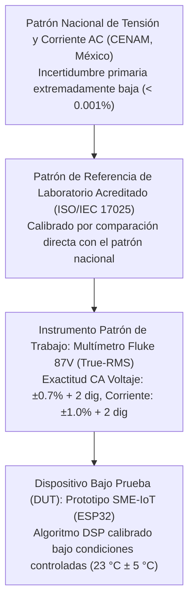

# Diseño e Implementación de un Sistema IoT de Bajo Costo para la Monitorización No Intrusiva de Consumo Eléctrico Residencial mediante Arquitectura ESP32

## Contenido

1. Antecedentes del problema
2. Planteamiento del problema
3. Objetivo general
4. Objetivos específicos
5. Justificación
6. Marco Teórico
7. Hipótesis
8. Diseño metodológico
9. Cronograma
10. Presupuesto y financiamiento
11. Fuentes de información
12. Anexos

## 1 Antecedentes del problema

La gestión de la demanda energética es fundamental en la transición hacia redes eléctricas inteligentes (*Smart Grids*).

A nivel global, los Objetivos de Desarrollo Sostenible (ODS 7 y 12) subrayan la necesidad de mejorar la eficiencia energética residencial.

En México, el esquema tarifario de la Comisión Federal de Electricidad (CFE) estructura el costo en categorías escalonadas (tarifas 1 a 1F), penalizando el alto consumo mediante la tarifa DAC (Doméstica de Alto Consumo), la cual elimina el subsidio gubernamental.

Sin embargo, los medidores convencionales electromecánicos o digitales estándar funcionan como dispositivos de registro acumulativo sin capacidad de retroalimentación instantánea, limitando la capacidad del usuario para corregir hábitos de consumo en tiempo real.

Históricamente, el monitoreo no intrusivo de carga (NILM) ha evolucionado desde métodos analógicos hasta arquitecturas basadas en Internet de las Cosas (IoT).

Plataformas de hardware abierto como OpenEnergyMonitor han demostrado la viabilidad de usar sensores de corriente de núcleo partido y la biblioteca `EmonLib`, pero sus costos de adquisición e importación (>\$2,000 MXN) siguen siendo elevados para el mercado nacional.

Estudios recientes como Kaselimi et al. (2022) identifican como brechas pendientes la confiabilidad en escenarios reales y la accesibilidad para su implementación masiva en el sector doméstico.

## 2 Planteamiento del problema

El problema central radica en la desconexión entre el consumo físico de energía y la conciencia del usuario.

La falta de herramientas de diagnóstico accesibles impide la detección de consumos fantasma o ineficiencias en electrodomésticos.

Las causas son multifactoriales: opacidad de la medición fiscal, barreras económicas (costo de equipos comerciales como Sense o Shelly EM >\$1,500 MXN), complejidad de instalación y la invisibilidad inherente del recurso eléctrico.

Además, las fluctuaciones de voltaje en la red mexicana distorsionan las estimaciones basadas exclusivamente en medición de corriente.

Pregunta de investigación: ¿Es factible desarrollar e implementar un sistema de monitoreo eléctrico residencial IoT que, mediante la medición simultánea de voltaje y corriente con sensores no intrusivos y un microcontrolador ESP32, reduzca el costo de adquisición en un 60% respecto a analizadores de red comerciales, garantizando una precisión superior al 95% en el cálculo de potencia activa real y permitiendo la detección de anomalías en el suministro, validándolo en una vivienda unifamiliar con servicio monofásico ubicada en Tenango del Valle, Estado de México?

## 3 Objetivo general

Diseñar, implementar y validar un sistema de monitoreo de consumo eléctrico residencial de bajo costo y no intrusivo, basado en el microcontrolador ESP32 y sensores de corriente tipo *clamp* (SCT-013) y de voltaje (ZMPT101B), capaz de calcular la potencia activa en tiempo real con un error inferior al 5% respecto a instrumentación de referencia, y de transmitir los datos de manera inalámbrica mediante conectividad WiFi.

## 4 Objetivos específicos

* Analizar los requerimientos funcionales y no funcionales del sistema bajo las condiciones de la infraestructura eléctrica mexicana y las restricciones técnicas de los componentes.
* Diseñar la etapa de hardware del sistema, incluyendo el circuito de acondicionamiento de señal para los sensores SCT-013, ZMPT101B, y el sistema de alimentación conmutada AC-DC integrado.
* Desarrollar el firmware de adquisición de datos y procesamiento digital de señales —cálculo de corriente eficaz ($I_{RMS}$), voltaje eficaz ($V_{RMS}$) y potencia activa ($P$)— sobre la arquitectura de doble núcleo del ESP32.
* Implementar la interfaz de usuario local (pantalla OLED SSD1306) y el módulo de almacenamiento local (tarjeta microSD) para la visualización y registro histórico.
* Validar el desempeño del prototipo mediante pruebas comparativas contra instrumentación patrón (multímetro TRMS calibrado) en laboratorio y campo.
* Evaluar la viabilidad económica del dispositivo mediante el análisis de la lista de materiales (BOM) y la comparación de costos frente al mercado.

## 5 Justificación

La investigación es conveniente porque proporciona una herramienta de diagnóstico instantáneo frente a la opacidad de la medición fiscal bimestral de CFE.

Tiene relevancia social al democratizar el acceso a tecnología de eficiencia energética para familias mexicanas, reduciendo el costo de inversión a ~\$600 MXN.

Desde una implicación práctica, permite identificar patrones de uso ineficiente sin riesgos de instalación intrusiva, eliminando la necesidad de alterar el cableado fijo de la vivienda.

Aporta valor teórico al validar la aplicabilidad de la Ley de Faraday y el teorema de Nyquist-Shannon en una plataforma de hardware con restricciones severas de costo y resolución (ADC de 12 bits).

## 6 Marco Teórico

El desarrollo de sistemas de monitoreo de energía en el hogar usando microcontroladores y tecnología de Internet de las Cosas (IoT) ha ganado gran relevancia. A continuación, se explican las bases teóricas y el funcionamiento de los componentes utilizados en este proyecto, describiendo de forma clara las leyes eléctricas y el procesamiento digital de las señales:

* **Microcontrolador ESP32 y Sistemas Embebidos (IoT):** El cerebro del proyecto es el módulo ESP32, un microcontrolador de bajo costo y alto rendimiento desarrollado por Espressif Systems.
  
  Su estructura interna es ideal para este proyecto por las siguientes características:
  * **Procesamiento de Doble Núcleo (Xtensa® LX6 de 32 bits a 240 MHz):** El sistema permite realizar tareas en paralelo utilizando el sistema operativo FreeRTOS.
  
    El **Núcleo 1** se encarga exclusivamente de la tarea crítica de leer los sensores a alta velocidad (aproximadamente 2,000 veces por segundo o 2 kHz) y realizar los cálculos matemáticos para obtener el voltaje ($V_{RMS}$), la corriente ($I_{RMS}$) y la potencia ($P$).
    
    El **Núcleo 0** se ocupa de las tareas secundarias que requieren más tiempo y podrían retrasar las lecturas, como mostrar la información en la pantalla OLED, guardar los datos de consumo en la tarjeta microSD y enviar la información a internet por WiFi.
    
    Esta división de tareas asegura que el microcontrolador nunca pierda lecturas de la corriente o el voltaje por estar ocupado transmitiendo datos o escribiendo en la memoria.
  * **Limitaciones del Convertidor Analógico-Digital (ADC):** El ESP32 cuenta con convertidores analógico-digitales para leer voltajes variables.
  
    Sin embargo, existe una restricción de diseño: el convertidor secundario (ADC2) no puede funcionar al mismo tiempo que el módulo WiFi está encendido. Por esta razón, el diseño de este prototipo conecta obligatoriamente todos los sensores al convertidor principal (ADC1), específicamente en los pines GPIO 32 a 39.
    
    El convertidor del ESP32 tiene una resolución de 12 bits, lo que significa que puede dividir el rango de 0 a 3.3 V en 4,096 niveles. Esto brinda una excelente precisión para electrodomésticos comunes, aunque para cargas muy pequeñas (menores a 25 W, como aparatos en modo de espera), el ruido eléctrico normal de la placa puede dificultar la medición, creando una pequeña "zona muerta" en esas lecturas.
* **Sensor de Corriente SCT-013-030 (Monitoreo No Intrusivo):** Este sensor de tipo pinza se basa en el principio físico del electromagnetismo: la corriente que pasa por un cable genera un campo magnético a su alrededor.
  
  Al cerrar la pinza del sensor sobre el cable de fase de la casa, el núcleo de ferrita recoge este campo magnético variable. Siguiendo la Ley de Inducción de Faraday, este campo variable genera una corriente eléctrica muy pequeña en un devanado secundario de 3,000 vueltas dentro del sensor:
  
  $$i_s(t) = \frac{i_p(t)}{3000}$$
  
  El modelo SCT-013-030 incluye en su interior una resistencia de carga de precisión de $62\,\Omega$. Esta resistencia transforma la pequeña corriente secundaria generada en un voltaje alterno que el microcontrolador puede leer, entregando una salida máxima de 1 V cuando por el cable principal circulan 30 A.
  
  Dado que el ESP32 solo puede medir voltajes positivos de 0 a 3.3 V, y la señal del sensor oscila entre valores positivos y negativos, se añade un circuito simple con dos resistencias de $10\text{ k}\Omega$ para sumar un voltaje de offset de 1.65 V. De esta manera, la señal se desplaza hacia la zona positiva y oscila de forma segura para ser leída por el microcontrolador.
* **Sensor de Voltaje ZMPT101B y Aislamiento Eléctrico:** Este componente es un pequeño transformador de voltaje de alta precisión que sirve para leer de forma directa la señal de la red eléctrica de 127 V AC de manera segura. El sensor ofrece un aislamiento completo que protege al microcontrolador de posibles sobrevoltajes.
  
  Medir el voltaje real en tiempo real es fundamental en este proyecto. En lugar de asumir un voltaje fijo de 127 V (lo que provocaría errores en el cálculo del consumo debido a las variaciones habituales en la red de CFE), el sensor permite capturar las variaciones instantáneas del suministro eléctrico.
  
  El módulo ZMPT101B se alimenta con 3.3 V DC, por lo que su circuito integrado (LM358) ajusta de manera automática la onda de voltaje para que quede centrada en 1.65 V, permitiendo que oscile de forma segura dentro del rango del pin analógico GPIO 33 del ESP32 sin necesidad de componentes externos.
* **Teoría de Potencia en Corriente Alterna y Cargas del Hogar:** En corriente alterna, la potencia de un aparato varía a cada instante según el voltaje y la corriente en ese momento:
  
  $$p(t) = v(t) \cdot i(t)$$
  
  En aparatos puramente resistivos (como focos incandescentes o planchas), las ondas de voltaje y corriente van de la mano, por lo que toda la energía se aprovecha por completo. Sin embargo, muchos electrodomésticos comunes tienen motores (como refrigeradores o lavadoras) o fuentes electrónicas (como computadoras y pantallas) que desfasan estas ondas entre sí.
  
  Esto da lugar a diferentes tipos de potencia:
  * **Potencia Activa ($P$ en Watts):** Es la energía real que consumen los aparatos para realizar un trabajo útil (generar luz, calor o movimiento).
  * **Potencia Aparente ($S$ en Volt-Amperios):** Es la potencia total que la compañía eléctrica debe entregar al hogar para que los aparatos funcionen.
  * **Potencia Reactiva ($Q$ en Volt-Amperios Reactivos):** Es la energía que oscila de ida y vuelta en los motores para crear sus campos magnéticos, sin realizar un trabajo útil directo.
  * **Factor de Potencia ($FP$):** Es la relación entre la potencia útil (activa) y la potencia total (aparente). Su valor va de 0 a 1.00:
    
    $$FP = \frac{P}{S}$$
    
    Un factor de potencia cercano a 1.00 indica un excelente aprovechamiento de la energía, mientras que un factor bajo indica pérdidas por desfase o ruidos en la red (armónicos). El prototipo calcula la potencia activa real mediante la multiplicación rápida y continua de las muestras de voltaje y corriente tomadas por el programa, garantizando un registro preciso del consumo del hogar.
* **Muestreo de Datos y Procesamiento Digital:** Para que el microcontrolador pueda medir de forma correcta una señal de corriente alterna de 60 Hz y sus variaciones rápidas, se debe cumplir el teorema de Nyquist. Este teorema indica que la velocidad de lectura (muestreo) debe ser al menos del doble de la frecuencia más alta que queramos capturar.
  
  En el programa del ESP32, se configura el Núcleo 1 para leer los sensores a una velocidad de aproximadamente 2,000 muestras por segundo (2 kHz). A cada muestra digital de voltaje ($v[n]$) y corriente ($i[n]$) se le resta digitalmente el offset de 1.65 V para centrarla en cero, y luego se aplican las fórmulas promedio sobre un grupo de 2,000 muestras (que equivalen a varios ciclos de la red eléctrica):
  
  * **Voltaje Eficaz ($V_{RMS}$):**
    $$V_{RMS} = \sqrt{\frac{1}{N} \sum_{n=0}^{N-1} (v[n] - V_{offset})^2}$$
  
  * **Corriente Eficaz ($I_{RMS}$):**
    $$I_{RMS} = \sqrt{\frac{1}{N} \sum_{n=0}^{N-1} (i[n] - I_{offset})^2}$$
  
  * **Potencia Activa ($P$):**
    $$P = \frac{1}{N} \sum_{n=0}^{N-1} (v[n] - V_{offset}) \cdot (i[n] - I_{offset})$$
  
  Este método permite calcular el consumo real de cualquier aparato eléctrico en el hogar, superando por mucho los métodos sencillos que asumen un voltaje de red constante.
* **Fuentes de Alimentación y Normas Eléctricas:** Para alimentar el prototipo de forma segura, se utiliza una pequeña fuente conmutada comercial (Hi-Link) que reduce el voltaje de la casa (127 V AC) a un nivel seguro de 5 V DC con alta eficiencia.
  
  El diseño e instalación del prototipo se realiza de forma no intrusivo y con fines educativos, respetando las pautas básicas de seguridad de la norma oficial mexicana **NOM-001-SEDE-2012** para asegurar que sea seguro de usar en el hogar.
* **Protocolos de Comunicación (I2C, SPI y MQTT):** Para que el ESP32 pueda controlar la pantalla, guardar la información y enviar los datos a internet, se utilizan los siguientes estándares:
  
  * **Bus I2C:** Es un protocolo sencillo que utiliza solo dos cables de comunicación (datos y reloj) para enviar las lecturas instantáneas a la pantalla OLED SSD1306, lo que permite ahorrar pines del microcontrolador.
  * **Bus SPI:** Es un protocolo de comunicación muy rápido que utiliza 4 hilos para guardar las lecturas en la tarjeta microSD casi al instante. Su alta velocidad evita que el programa principal se retrase al escribir en la tarjeta.
  * **Protocolo MQTT:** Es un estándar de comunicación rápido y ligero diseñado para internet de las cosas. Funciona mediante un modelo de "publicación y suscripción", donde el ESP32 envía los datos de consumo organizados en temas (por ejemplo, `casa/monitoreo/potencia`) hacia un servidor central (Broker). Al usar cabeceras de mensaje extremadamente pequeñas (de apenas 2 bytes), consume muy poco ancho de banda de internet y permite ver el consumo en tiempo real en una aplicación móvil o web con una respuesta casi instantánea.

## 7 Hipótesis

En el diseño y validación del prototipo, las hipótesis planteadas buscan relacionar el rendimiento de la medición (errores y precisión) con el bajo costo de los componentes y las características de la instalación eléctrica.

* **Hipótesis general (de investigación - $H_i$):** Es viable diseñar y construir un prototipo de monitoreo eléctrico para el hogar que sea de bajo costo (con un presupuesto de materiales menor a \$600.00 MXN) y que mida la potencia activa con un error promedio menor al 5% en aparatos con consumos mayores a 25 W, al ser comparado con un multímetro de referencia.
  
  Esta hipótesis define las metas numéricas de costo y precisión para comprobar el éxito del prototipo.
* **Hipótesis nula ($H_0$):** El prototipo no alcanza la precisión deseada (el error promedio es mayor al 5%) o su costo total de materiales supera los \$600.00 MXN, por lo que el proyecto no resulta viable.
* **Hipótesis alternativa ($H_1$):** El prototipo tiene un costo de materiales menor o igual a \$600.00 MXN y registra un error de medición promedio menor o igual al 5% para cargas mayores a 25 W.
* **Hipótesis específicas:**
  * **Linealidad del sensor de corriente:** La señal entregada por el sensor SCT-013 y adaptada para el microcontrolador mantendrá una relación lineal y directa con la corriente real medida por el multímetro patrón, obteniendo un coeficiente de correlación $R^2 > 0.98$ en el rango de 0.5 A a 30 A.
  * **Estabilidad de la alimentación:** La fuente compacta Hi-Link integrada suministrará un voltaje continuo estable (con variaciones menores a 50 mV) para evitar que el ruido eléctrico distorsione las lecturas analógicas del microcontrolador.
  * **Cálculo de potencia en tiempo real:** Medir de manera simultánea las muestras rápidas de voltaje y corriente en tiempo real permitirá calcular una potencia activa más exacta que si se asumiera un voltaje fijo de 127 V.
  * **Costo accesible:** El costo total de la lista de materiales (BOM) se mantendrá por debajo de los \$600.00 MXN, logrando un ahorro de más del 60% en comparación con los medidores comerciales.
## 8 Diseño metodológico

El método de trabajo está estructurado para garantizar que las mediciones sean exactas y repetibles, validando el dispositivo tanto en pruebas de laboratorio como en condiciones reales en el hogar.

### 8.1 Universo (Población de estudio)
En este proyecto técnico, el universo de estudio no consiste en personas, sino en las **diferentes condiciones de consumo eléctrico** que se presentan en una instalación monofásica residencial dentro del rango de operación del sensor (de 0 A a 30 A).

Las pruebas finales de campo se realizarán en una vivienda típica con servicio monofásico de CFE (127 V, 60 Hz) ubicada en Tenango del Valle, Estado de México.

### 8.2 Tamaño de la muestra
Para validar el prototipo, se tomarán **270 lecturas comparativas** entre el prototipo y un instrumento de referencia (multímetro patrón). Estas lecturas se dividirán en 9 niveles de corriente diferentes (0.5 A, 1 A, 2 A, 5 A, 10 A, 15 A, 20 A, 25 A y 30 A), registrando 30 muestras en cada nivel para asegurar que el sensor funcione bien en todo su rango.

La selección de las pruebas se realizará de forma dirigida para cubrir la mayor cantidad posible de aparatos de uso común:
* **Criterios de inclusión:** Aparatos resistivos puros (como focos, planchas o calentadores) y aparatos inductivos comunes (como ventiladores, licuadoras o motores pequeños) conectados a la red de 127 V.
* **Criterios de exclusión:** Consumos extremadamente bajos por debajo de 0.2 A (que caen en la zona de ruido del sensor), instalaciones de tipo trifásico y aparatos industriales especiales.

### 8.3 Tipos de investigación a realizar
* **Finalidad:** *Aplicada y Tecnológica* (utiliza principios teóricos de electricidad y programación para construir un prototipo real).
* **Enfoque:** *Cuantitativo* (el éxito se mide con datos numéricos de precisión, voltios, amperios y costos).
* **Alcance:** *Correlacional* (compara directamente las mediciones del prototipo contra el multímetro de referencia para analizar sus diferencias).
* **Lugar:** *Mixto*, iniciando con pruebas controladas en un **laboratorio** escolar y finalizando con mediciones de campo en un **hogar** real.

### 8.4 Tipo de instrumento a utilizar para la recolección de la información
El dispositivo bajo prueba es el **Prototipo SME-IoT**, que integra el ESP32 y los sensores SCT-013 y ZMPT101B.

Para validar que las lecturas sean precisas, se utilizará un **Multímetro Industrial Fluke 87V (Instrumento Patrón)** como equipo de referencia. Este multímetro profesional de alta resolución tiene una precisión certificada del $\pm 0.7\%$ para lecturas de voltaje y de $\pm 1.0\%$ para corriente (Fluke Corporation, 2020). Además, cuenta con un certificado de calibración vigente de un laboratorio acreditado bajo la norma internacional **ISO/IEC 17025:2017**, garantizando la total confiabilidad de las pruebas.

#### 8.4.1 Cadena de Trazabilidad Metrológica
La confianza de las mediciones del prototipo se basa en una cadena de comparación que llega hasta los patrones nacionales de medición en México. A continuación, se muestra el camino de calibración establecido:

Figura 8.1. Cadena de trazabilidad metrológica del prototipo

1. **Patrón Nacional (CENAM):** Es la máxima autoridad de medición en México, encargada de mantener los patrones más precisos de voltaje y corriente en el país.
2. **Laboratorio Secundario Acreditado:** Laboratorio externo certificado por la Entidad Mexicana de Acreditación (EMA) que calibra el multímetro Fluke contra sus patrones de alta precisión de forma periódica.
3. **Instrumento Patrón (Fluke 87V):** Es el multímetro que usamos directamente en la mesa de pruebas para verificar que el prototipo mida de forma correcta. Su filtro integrado elimina ruidos externos para no falsear las pruebas.
4. **Prototipo SME-IoT (Dispositivo bajo prueba):** Se ajusta mediante el programa del ESP32 en un ambiente controlado (temperatura de 23 °C $\pm 5$ °C) para asegurar que las mediciones posteriores en la casa sean exactas.

Para registrar los datos de manera automática y ordenada, el prototipo guardará los valores de voltaje ($V_{RMS}$), corriente ($I_{RMS}$), potencia activa ($P$), potencia aparente ($S$) y factor de potencia ($FP$) en un archivo de texto plano delimitado por comas (`.CSV`) dentro de una **tarjeta microSD** conectada por bus SPI. Cada registro incluirá la fecha y hora exacta gracias a un módulo de reloj de tiempo real (RTC DS3231) incorporado.

### 8.5 Procesamiento y Análisis de Datos (Calibración)
Las mediciones obtenidas se procesarán utilizando herramientas sencillas en hojas de cálculo (Microsoft Excel) o mediante pequeños programas en Python (con las bibliotecas Pandas y NumPy).

El análisis para comprobar el correcto funcionamiento del dispositivo se dividirá en las siguientes fases:

#### 8.5.1 Fórmulas de Calibración y Ajuste de Coeficientes
El programa del ESP32 utiliza constantes multiplicadoras para convertir las lecturas analógicas del sensor a valores físicos reales de voltaje y corriente. Antes del experimento, el prototipo se calibra con cargas conocidas y estables:

* **Calibración de Voltaje ($V_{CAL}$):**
  $$V_{CAL} = \frac{V_{Real}}{V_{Crudo\_ESP}}$$
  Donde $V_{Real}$ es el voltaje del multímetro Fluke y $V_{Crudo\_ESP}$ es la lectura directa sin calibrar del microcontrolador.
* **Calibración de Corriente ($I_{CAL}$):**
  $$I_{CAL} = \frac{I_{Real}}{I_{Crudo\_ESP}}$$
* **Ajuste de Desfase de Fase ($Phase_{CAL}$):**
  Los sensores magnéticos introducen por su naturaleza un pequeño retraso entre la onda de voltaje y de corriente, lo que afecta el cálculo de la potencia activa. Para corregir este retraso, el programa del ESP32 realiza un ajuste por software para alinear de nuevo ambas ondas:
  $$v_{corregido}[n] = v[n] + Phase_{CAL} \cdot (v[n] - v[n-1])$$
  Este coeficiente se calibra conectando una carga resistiva pura (como una plancha, donde el desfase real es cero) y ajustando el valor de $Phase_{CAL}$ hasta que el factor de potencia calculado en la pantalla sea exactamente de 1.00.

#### 8.5.2 Análisis de Precisión y Linealidad
Una vez calibrado el sistema, se evaluará la calidad de las mediciones mediante las siguientes técnicas:
* **Estadística Descriptiva:** Cálculo de promedios, desviaciones de las lecturas e intervalos de confianza para cada nivel de corriente probado.
* **Regresión Lineal:** Ajuste de curvas de calibración para comprobar que el sensor de corriente sea lineal en todo su rango de 0.5 A a 30 A, buscando un coeficiente de determinación $R^2 > 0.98$.
* **Métrica de Error (MAPE):** El error promedio se calculará mediante el **Error Porcentual Absoluto Medio (MAPE)**:
  $$MAPE = \frac{100\%}{M} \sum_{m=1}^{M} \left| \frac{X_{Patron,m} - X_{Prototipo,m}}{X_{Patron,m}} \right|$$
  Donde $M$ es el número de muestras y $X$ representa la potencia medida. Se considerará exitoso si el error promedio es menor al 5% en consumos superiores a 25 W.
* **Validación de Medios:** Se realizará una comparación directa entre los promedios del prototipo y del multímetro para certificar que las diferencias observadas caigan dentro de límites aceptables y no representen un error sistemático grave en las lecturas.

#### 8.5.3 Procedimiento de Pruebas Paso a Paso
Para asegurar que las pruebas puedan repetirse bajo las mismas condiciones, se seguirá detalladamente esta rutina de laboratorio:

1. **Estabilización Térmica:**
   * Conectar el prototipo SME-IoT y el multímetro Fluke en la mesa de trabajo en condiciones normales de laboratorio.
   * Dejar encendidos ambos equipos en reposo durante **15 minutos** sin conectar ninguna carga. Este paso es fundamental para estabilizar los componentes del circuito y evitar que el calentamiento inicial de las piezas afecte la precisión de las lecturas.
2. **Registro de Punto Cero o Sin Carga ($I_{offset}$ y $V_{offset}$):**
   * Con la corriente del circuito principal en cero amperios (0.00 A), el microcontrolador tomará un promedio rápido de 10,000 muestras seguidas.
   * El programa registrará los voltajes promedio entregados por los sensores en reposo (que deben estar muy cerca de 1.65 V) y los fijará como los valores de referencia central.
3. **Calibración de Escala ($V_{CAL}$ e $I_{CAL}$):**
   * Conectar un calentador o plancha eléctrica estable de aproximadamente 1,200 W (que demanda unos 9.45 A).
   * Registrar los valores estables de voltaje y corriente en el multímetro de referencia y ajustar las constantes en el programa del ESP32 hasta que las lecturas en pantalla coincidan con las del multímetro.
4. **Calibración de Desfase de Fase ($Phase_{CAL}$):**
   * Manteniendo conectada la misma plancha o resistencia, observar el factor de potencia que indica el prototipo.
   * Ajustar por consola el parámetro de desfase en el programa del microcontrolador hasta que la pantalla indique un factor de potencia estable de **1.00 $\pm 0.01$**.
5. **Rutina de Recolección de Datos:**
   * Utilizar cargas variables para ajustar de forma estable los 9 niveles de corriente estudiados (desde 0.5 A hasta 30 A).
   * En cada nivel de corriente, esperar a que la lectura se estabilice y registrar automáticamente **30 mediciones** seguidas (con 10 segundos de separación entre cada una).
   * El firmware guardará cada muestra en formato `.CSV` en la tarjeta microSD, registrando la hora, voltios, amperios, watts y factor de potencia, mientras se anota de manera manual la lectura real del multímetro Fluke 87V para la posterior comparación en Excel.

### 8.6 Encuesta y Prueba Piloto Técnica
Se realizará una encuesta preliminar a 10 viviendas en Tenango del Valle para conocer su opinión sobre el costo de la luz y validar que el presupuesto propuesto (menor a \$600.00 MXN) sea aceptable para los usuarios.

De manera adicional, se ejecutará una **prueba piloto rápida** utilizando solo 2 o 3 niveles de carga eléctrica.

Esta prueba previa servirá para comprobar que los sensores no se calienten de más, verificar que la tarjeta microSD guarde el archivo `.CSV` de forma correcta y comprobar que la conexión WiFi con el protocolo MQTT se restablezca sola en caso de fallas, asegurando que todo funcione bien antes de realizar la prueba completa.

## 9 Cronograma

Tabla 9.1. Cronograma de actividades

| Fase | Actividad | Inicio | Fin |
| :--- | :--- | :---: | :---: |
| F1 | Investigación de antecedentes y estructuración del planteamiento técnico | 02-Feb | 13-Feb |
| F2 | Definición de objetivos y delimitación del impacto del proyecto | 16-Feb | 06-Mar |
| F3 | Integración del marco teórico y revisión del estado del arte | 09-Mar | 20-Mar |
| F4 | Formulación de hipótesis y definición de variables | 23-Mar | 03-Abr |
| F5 | Diseño metodológico y preparación del protocolo experimental | 06-Abr | 24-Abr |
| F6 | Entrega del proyecto final (Protocolo de Investigación documental) | 27-Abr | 29-May |

## 10 Presupuesto y financiamiento

Tabla 10.1. Presupuesto detallado de hardware

| Componente | Costo MXN |
| :--- | :--- |
| ESP32 DevKit V1 | \$130.00 |
| Sensor de Corriente SCT-013-030 | \$185.00 |
| Sensor de Voltaje ZMPT101B | \$50.00 |
| Fuente Hi-Link HLK-PM01 | \$75.00 |
| Pantalla OLED SSD1306 | \$65.00 |
| Componentes pasivos (placa, resistencias, capacitores) y gabinete | \$95.00 |
| **Total aproximado** | **\$600.00** |

**Financiamiento:** 
El proyecto será autofinanciado por el investigador para el desarrollo del prototipo académico inicial en etapas posteriores.

## 11 Fuentes de información

* Alexander, C. K., & Sadiku, M. N. (2013). *Fundamentals of electric circuits* (5th ed.). McGraw-Hill.
* Arias, F. G. (2012). *El proyecto de investigación: Introducción a la metodología científica* (6ª ed.). Editorial Episteme.
* Bland, J. M., & Altman, D. G. (1986). Statistical methods for assessing agreement between two methods of clinical measurement. *The Lancet*, *1*(8476), 307–310. https://pubmed.ncbi.nlm.nih.gov/2868172/
* Boylestad, R. L. (2010). *Introductory circuit analysis* (12th ed.). Prentice Hall.
* Comisión Federal de Electricidad. (2024). *Tarifas domésticas de energía eléctrica*. CFE. https://app.cfe.mx/Aplicaciones/CCFE/Tarifas/TarifasCRECasa/Casa.aspx
* Creswell, J. W., & Creswell, J. D. (2018). *Research design: Qualitative, quantitative, and mixed methods approaches* (5th ed.). SAGE Publications.
* Davis, F. D. (1989). Perceived usefulness, perceived ease of use, and user acceptance of information technology. *MIS Quarterly*, *13*(3), 319–340. https://doi.org/10.2307/249008
* Espressif Systems. (2022). *ESP32 Series Datasheet* (ver. 3.4). https://www.espressif.com/documentation/esp32_datasheet_en.pdf
* Fluke Corporation. (2020). *Fluke 87V Industrial Multimeter Precision Datasheet & Manual*. Fluke.
* Hart, D. W. (2011). *Power electronics*. McGraw-Hill Education.
* Hernández Sampieri, R., Fernández Collado, C., & Baptista Lucio, M. del P. (2014). *Metodología de la investigación* (6ª ed.). McGraw-Hill Education.
* IEC 62053-21:2020. *Electricity metering equipment - Particular requirements - Part 21: Static meters for AC active energy (classes 1 and 2)*. International Electrotechnical Commission.
* Kaselimi, M., Protopapadakis, E., Voulodimos, A., Doulamis, N., & Doulamis, A. (2022). Towards Trustworthy Energy Disaggregation: A Review of Challenges, Methods, and Perspectives for Non-Intrusive Load Monitoring. *Sensors*, *22*(15), 5872. https://doi.org/10.3390/s22155872
* Motorola, Inc. (2003). *SPI Block Guide* (Version 03.06).
* Naciones Unidas. (2015). *Transformar nuestro mundo: La Agenda 2030 para el Desarrollo Sostenible*. https://sdgs.un.org/2030agenda
* Norma Oficial Mexicana NOM-001-SEDE-2012. *Instalaciones Eléctricas (Utilización)*. Diario Oficial de la Federación, México.
* NXP Semiconductors. (2021). *I2C-bus specification and user manual* (Rev. 7, UM10204). https://www.nxp.com/docs/en/user-guide/UM10204.pdf
* OASIS. (2019). *MQTT Version 5.0* (Edited by A. Banks, E. Briggs, K. Borgendale, & R. Gupta). https://docs.oasis-open.org/mqtt/mqtt/v5.0/os/mqtt-v5.0-os.html
* Oppenheim, A. V., & Schafer, R. W. (2010). *Discrete-time signal processing* (3rd ed.). Prentice Hall.
* Shapiro, S. S., & Wilk, M. B. (1965). An analysis of variance test for normality (complete samples). *Biometrika*, *52*(3–4), 591–611. https://doi.org/10.1093/biomet/52.3-4.591
* Tamayo y Tamayo, M. (2009). *El proceso de la investigación científica* (5. ed.). Limusa.

## 12 Anexos

### Anexo A: Matriz de operacionalización de las variables experimentales

Esta matriz define cómo las variables teóricas de la investigación serán medidas empíricamente por el prototipo, garantizando la rigurosidad cuantitativa del estudio.

Tabla 12.1. Matriz de operacionalización de variables experimentales

| Variable | Tipo | Definición Conceptual | Definición Operacional (Instrumentación) | Unidad / Escala |
| :--- | :--- | :--- | :--- | :--- |
| **Carga Eléctrica** | Independiente | Demanda física de energía requerida por un electrodoméstico conectado a la red. | Corriente alterna inyectada de forma controlada a través de un banco de cargas resistivas e inductivas, capturada por el sensor SCT-013-030. | Amperios (A) *Rango: 0.5 A – 30.0 A* |
| **Potencia Activa ($P$)** | Dependiente | Energía real consumida por la carga que produce un trabajo útil, considerando el desfase por el factor de potencia. | Promedio del producto iterativo de las lecturas analógicas instantáneas ($v[n]$ e $i[n]$) digitalizadas por el ADC1 del ESP32 a $f_s \approx 1$ kHz. | Vatios (W) *Escala de Razón* |
| **Error Porcentual (MAPE)** | Dependiente | Desviación estadística promedio de la medición del prototipo respecto al valor real. | Diferencia absoluta entre la lectura del Multímetro TRMS calibrado (Patrón) y el Prototipo SME-IoT, dividida por el valor Patrón. | Porcentaje (%) *Criterio de éxito: $<5\%$* |
| **Voltaje de Red** | Interviniente / Control | Diferencia de potencial eléctrico real suministrada por la CFE en la acometida. | Señal aislada obtenida mediante el ZMPT101B, digitalizada y centrada digitalmente para eliminar fluctuaciones y armónicos. | Voltios (V) *Nominal: 127 V AC* |

### Anexo B: Borrador del instrumento de encuesta (Consulta técnica preliminar)

Este instrumento está fundamentado en el **Modelo de Aceptación de Tecnología (TAM)** propuesto por Davis (1989), adaptado para la evaluación de medidores inteligentes residenciales (*Smart Meters*).

Evalúa la Utilidad Percibida (PU), Facilidad de Uso Percibida (PEOU), Confianza y Viabilidad Económica.

Se aplicará a una muestra piloto de 10 usuarios residenciales.

**Objetivo:** Identificar la percepción de opacidad en la medición fiscal, evaluar la intención de adopción de tecnología IoT y validar empíricamente el umbral de viabilidad económica propuesto (< \$600 MXN).

**Cuestionario (Escala Likert y Opción Múltiple):**

* **Sección 1: Utilidad Percibida (PU)**
  1. El recibo bimestral actual de CFE me permite entender claramente qué electrodomésticos consumen más energía en mi hogar.
     *(1: Totalmente en desacuerdo - 5: Totalmente de acuerdo)*
  2. Un dispositivo que me muestre mi consumo de energía en tiempo real en mi celular me ayudaría a reducir mis costos eléctricos.
     *(1: Totalmente en desacuerdo - 5: Totalmente de acuerdo)*

* **Sección 2: Facilidad de Uso y Confianza (PEOU & Trust)**
  3. Me preocupa la privacidad de mis datos de consumo si utilizo un dispositivo comercial que dependa de suscripciones o servidores extranjeros.
     *(1: Totalmente en desacuerdo - 5: Totalmente de acuerdo)*
  4. Me sentiría más seguro instalando un sensor "no intrusivo" (que solo se sujeta sobre el cable principal sin cortarlo) en comparación con solicitar modificaciones al cableado de mi casa.
     *(1: Totalmente en desacuerdo - 5: Totalmente de acuerdo)*

* **Sección 3: Viabilidad Económica e Intención de Uso (BI)**
  5. Sabiendo que los monitores de energía comerciales (ej. Sense o Shelly EM) cuestan más de \$1,500 MXN, ¿Cuál es la inversión máxima que realizaría por un dispositivo de código abierto fabricado localmente que cumpla la misma función?
     [ ] Menos de \$500 MXN
     [ ] Entre \$500 y \$700 MXN
     [ ] Entre \$700 y \$1,000 MXN
     [ ] Más de \$1,000 MXN

### Anexo C: Diagrama esquemático preliminar del circuito de acondicionamiento de señal

Debido a que las señales eléctricas de la red domiciliaria oscilan en valores alternos (AC) que incluyen voltajes negativos, y el convertidor analógico-digital (ADC) del microcontrolador ESP32 únicamente admite valores positivos de voltaje (0 a 3.3 V DC), es necesario diseñar un circuito de acondicionamiento previo. El siguiente esquema describe el funcionamiento y la construcción física del prototipo:

1. **Acondicionamiento de Corriente (Sensor SCT-013-030):**
   * El sensor tipo pinza se abraza magnéticamente al cable de fase de la casa, entregando una señal alterna proporcional a la corriente medida (de 0 a 1 V AC).
   * Se construye un divisor de voltaje con dos resistencias de precisión de $10\text{ k}\Omega$ conectadas en serie entre los pines de 3.3 V y GND del ESP32.
   * El punto medio de este circuito añade un voltaje central estable de **1.65 V** a la señal del sensor.
   * Se agrega un condensador de $10\,\mu\text{F}$ en paralelo para estabilizar la señal de referencia de voltaje y filtrar el ruido eléctrico del circuito.
   * La onda de corriente se desplaza así a la zona positiva del microcontrolador, oscilando de forma segura entre **$\approx 0.236$ V y $3.064$ V** al medir la carga máxima de 30 A (lo que equivale a un pico de $1.414$ V sobre la señal del sensor), ingresando de forma segura por el pin analógico **GPIO 32 (ADC1)**.
2. **Acondicionamiento de Voltaje (Módulo ZMPT101B):**
   * El transformador del sensor reduce la tensión de la casa (127 V AC) de forma segura y aislada eléctricamente.
   * Para asegurar que sea compatible con el microcontrolador sin añadir circuitos complejos, la placa del sensor se alimenta directamente a **3.3 V DC** (en lugar de los 5 V DC habituales). De este modo, el circuito del sensor ajusta de forma automática la onda a un voltaje central de **1.65 V DC** (la mitad del voltaje de alimentación), y su amplitud de señal se ajusta de forma manual con el potenciómetro de la placa.
   * La señal de voltaje ya desplazada oscila de manera segura en el rango de 0 V a 3.3 V y se conecta al pin analógico **GPIO 33 (ADC1)**.
3. **Módulo de Alimentación Aislada (SMPS):**
   * Se añade una fuente de alimentación compacta Hi-Link HLK-PM01 conectada en paralelo a la red eléctrica residencial de 127 V AC.
   * Esta fuente entrega 5 V DC estables y aislados en su salida para alimentar el pin `VIN` del ESP32. El regulador de voltaje interno del microcontrolador se encarga de reducir y estabilizar este voltaje a 3.3 V DC para alimentar el resto de las piezas del prototipo, permitiendo que el dispositivo sea autónomo y funcione de manera segura.
